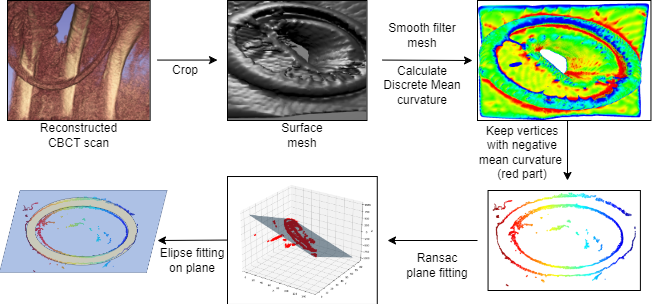
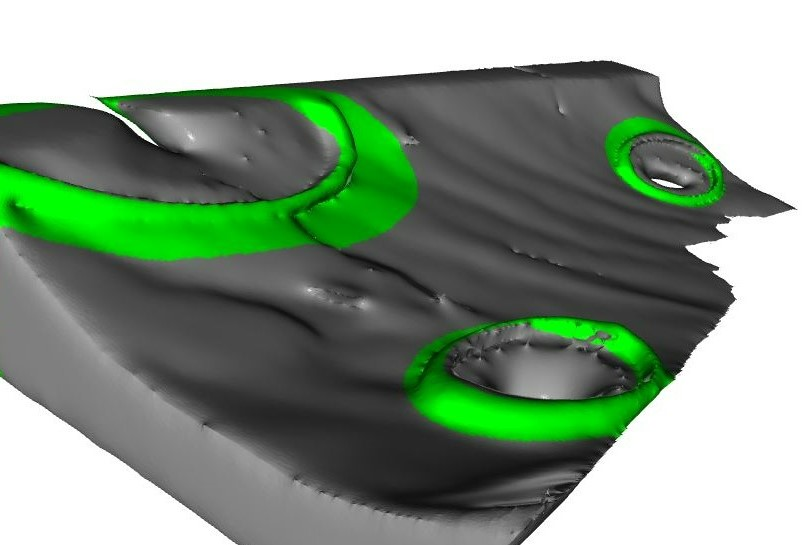

In Video-Assisted Thoracoscopic Surgery (VATS), positioning the virtual pulmonary nodule for
Augmented Reality (AR) Endoscopy guidance is a non-trivial task. The first step in AR VATS
is finding the endoscope's position by solving the projection equation of the same objects in
2D and 3D. In this project, we proposed an automatic segmentation method and projection of
surgical protection rings in 3D CBCT onto their 2D image counterpart. For 3D CBCT, plane
and ellipse fitting algorithm coupled with normal curvature thresholding and Gaussian Mixture
Model are applied while a simple hue channel thresholding is sufficient for 2D endoscopy surgical
protector ring segmentation. Despite being an unsupervised method due to unavailability of
labeled data, experimental results show that our method can automatically detect and segment
multiple 3D surgical rings on a surface mesh derived from the voxelized 3D CBCT scan of a
patient's chest area. It is important to note that the performance of this method relies heavily
on the accuracy of the ellipse fitting algorithm under noisy data points.

<p align="center">
  
  
</p>

**Acknowledgement**:

Code for ellipse fitting is from:
https://github.com/bdhammel/least-squares-ellipse-fitting

**Cite this work**
```
@conference{tluong_CBCT,
  author={Luong, The Cong and Rouzé, Simon and Dillenseger, Jean-Louis},
  title={Segmentation of Alexis Retractors in the context of augmented reality in Video-Assisted Thoracoscopic Surgery},
  booktitle={Proceedings of SPIE Medical Imaging 2025},
  year={2025},
  address={San Diego, CA, USA},
  month={February 17},
  note={Oral Presentation}
}
```
